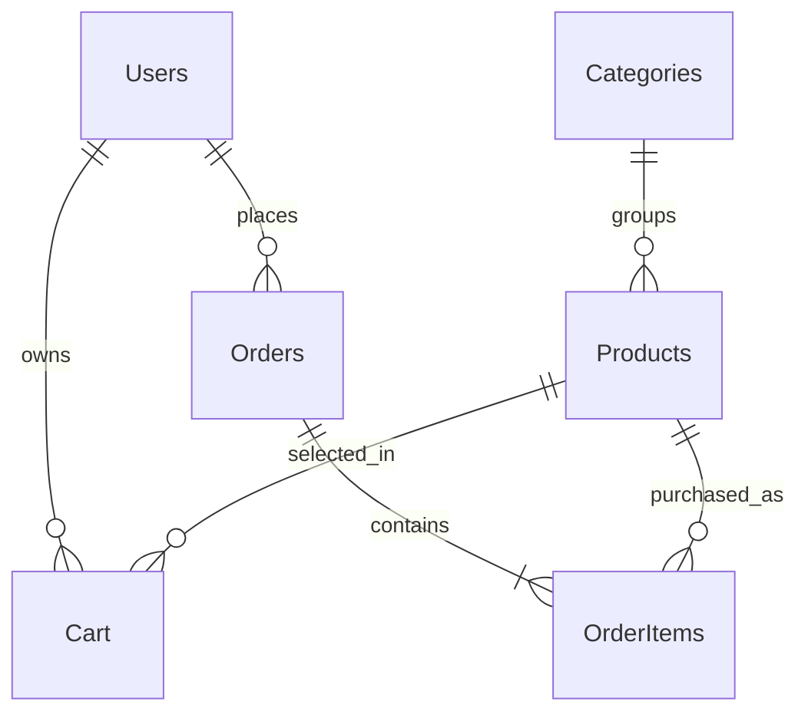

# Requirements analysis and implementation notes

## 1. What was supplied

The input was a detailed **project specification**, not existing application code. The initial repository contained only a README. This implementation therefore creates a new grocery-store application rather than attempting to translate nonexistent pharmacy source code.

The requested Web Forms/VB.NET/Access stack is retained. It is suitable for an academic demonstration on Windows but cannot run natively as an ASP.NET application in this Linux workspace. A different stack was not substituted merely to provide a browser preview.

## 2. Architecture

```text
Browser over HTTPS
  → Customer or Admin master page / .aspx code-behind
  → GroceryPage → CustomerPage → AdminPage authorization boundary
  → SecurityHelper / StoreService / AdminService
  → DatabaseHelper / DbSession
  → OleDb + ACE → App_Data/GroceryDB.accdb
```

This uses the ASP.NET **Web Site** compilation model. All helpers in `App_Code` are compiled automatically; `CodeFile` connects each page to its VB partial class. Master pages share navigation, encoded messages, and a session-bound CSRF field.

The implementation follows dependency order: schema and infrastructure precede authentication, shopping, checkout, administration, reports, and tests. Actual creation of the Access binary is deferred to Windows because a supported ACE provider is unavailable here.

## 3. Requirement mapping

| Area | Implementation |
|---|---|
| Home/categories/featured products | `Default.aspx` |
| Registration/login/logout | `Register.aspx`, `Login.aspx`, `Logout.aspx`, `SecurityHelper.vb` |
| Session and role checks | `GroceryPage.vb`, `Admin/Web.config` |
| Search and category filters | `Products.aspx`, literal substring search using parameterized `InStr` |
| Product quantity and details | `ProductDetails.aspx` |
| Persistent cart and totals | `Cart.aspx`, `StoreService.vb`, unique index |
| Transactional checkout | `Checkout.aspx`, `StoreService.Checkout` |
| Confirmation/history/ownership | `OrderDetails.aspx`, `Orders.aspx`; both details queries constrain UserID |
| Administrator login | Same login page; role routes to `Admin/Dashboard.aspx` |
| Categories | `Admin/ManageCategories.aspx` |
| Products/stock | `Admin/ManageProducts.aspx`, `AddProduct.aspx`, `EditProduct.aspx` |
| Customers | `Admin/ManageCustomers.aspx`; no password fields in results |
| Status/cancellation | `Admin/ManageOrders.aspx`, `AdminService.ChangeOrderStatus` |
| Dashboard | Counts, recent ten orders, pending count, low-stock, top-selling |
| Reports | Date-filtered sales/orders, delivered revenue, low-stock threshold, inventory; browser print/PDF |
| About/contact | Demonstration information, not fabricated live contact details |

## 4. Data model



The source specification's diagram linked Orders directly to Products; the actual relationship is through **OrderItems**. A committed application order must have at least one item; foreign keys alone cannot enforce that minimum cardinality, so checkout enforces it transactionally.

### Additions/refinements

| Field/index | Reason |
|---|---|
| `Users.PasswordHash` | Unambiguous hash-only storage; algorithm/rounds/salt/key encoded together |
| `Users.CartVersion` | Common write lock before cart mutations and checkout |
| `Products.Version` | Optimistic admin updates; stock changes increment it |
| `Orders.CheckoutToken` + unique index | Idempotent replay of the same submitted checkout |
| `OrderItems.ProductName`, `Unit` | Preserve descriptive history as well as original price |
| Unique normalized email | Duplicate registrations fail even under racing requests |
| Unique category name | Prevent confusing duplicate categories |
| Unique cart UserID/ProductID | Database-level duplicate prevention |
| Foreign keys without cascade delete | Keep referential integrity and historical orders |
| Access column validation rules | Nonnegative price/stock, positive quantities, allowed statuses/roles/payment |

`database/schema.sql` defines the tables, indexes, and relationships. The initialization script additionally applies ACE column validation rules through ADOX and sets zero-length support for optional descriptive fields. **Use the complete initializer**, not only the SQL, for an equivalent schema.

Stock represents saleable units of the listed pack, not fractional weight. `1 kg` with quantity 2 purchases two one-kilogram units. Money uses Access Currency and .NET Decimal; new prices allow at most two decimal places. Stored expiry is optional, and a product is valid through that day on the server's local clock.

## 5. Checkout correctness

1. Validate address, city, payment, and a server-generated ViewState-protected token.
2. Open a serializable OleDb transaction.
3. Update the active customer's CartVersion to serialize cart changes/checkout.
4. Return the existing customer-owned order if the token was already used.
5. Read cart/products/categories and validate nonempty cart, positive quantities, status, expiry, price, and stock.
6. Calculate total on the server, not from browser fields.
7. Insert Pending order and obtain `@@IDENTITY` on the **same connection**.
8. Conditionally decrement each product's stock (`StockQuantity >= requested`), increment product Version, and insert original-price/name/unit snapshots.
9. Clear only that customer's cart.
10. Commit; otherwise disposing the transaction rolls everything back.

ACE can raise a lock conflict rather than wait under concurrency. This is presented as a retryable user-safe database message. The failed transaction must not partially persist. The Windows tests include two customers attempting the final stock unit; real-provider behavior still needs verification on the target machine.

The order total can differ from an earlier cart display if prices changed before submission; checkout explains this. Production systems may instead require explicit price-change reconfirmation. There are no delivery fees, tax breakdowns, discounts, or online settlements in this version.

## 6. Order state machine

```text
Pending → Confirmed → Packed → Out for Delivery → Delivered
   └─────────┴─────────┴──────→ Cancelled
```

Cancellation is only permitted before dispatch. Both the current-status check and the stock restoration occur in one transaction. The conditional update includes the old status, so an already-cancelled order cannot restock twice. Delivered/Cancelled orders cannot be reopened by this interface. Returns, refunds, failed delivery, and post-dispatch cancellation require separate business policies and are not simulated.

Admin stock editing uses the Version loaded into ViewState. If a checkout/restock/edit changes Version, the old editor cannot silently overwrite inventory. Deleting products with cart/order references is refused; deactivate instead. Categories with any products cannot be deleted.

## 7. Security boundaries

- Parameterized OleDb commands with typed positional parameters; dynamic SQL fragments are fixed, application-controlled clauses.
- Random 16-byte password salts; PBKDF2-HMAC-SHA256, 600,000 iterations, 32-byte output; constant-work key comparison for valid hashes.
- Login attempts throttled per client address and email for 15 minutes in the single-process ASP.NET cache; unknown emails also perform password-derivation work.
- Registration fixes Role to Customer and Status to Active. Admin creation is an offline prompted setup operation.
- Forms ticket includes a random nonce bound to the authenticated session. Session user ID alone is insufficient for authorization. Account status/name/role are refreshed from the database on authenticated requests.
- HTTPS-only, HttpOnly, SameSite=Lax cookies. Authentication expires after 30 minutes without sliding renewal; session expiry may log the user out sooner.
- All postbacks require a session CSRF token. ViewState uses a per-session key, MAC, and encryption; event validation remains enabled. Login/logout also require CSRF validation.
- ASP.NET request validation plus HTML-encoded data output, bounded input lengths, constrained local image paths.
- Customer order reads include UserID in both header and item queries.
- Admin pages inherit AdminPage; management service entry points also require an authenticated admin page context.
- Safe error responses; detailed exceptions go to server-side Trace, never to page messages.

This is not a completed production security audit. The cache limiter is not distributed or durable, resets on process recycle, and can cause temporary account lockouts. Account recovery/MFA/audit trails are not implemented. Session ID renewal could be added for additional hardening; the current design binds the independent Forms ticket to a fresh session nonce on login. SameSite is defense in depth, not a substitute for CSRF validation.

## 8. Operational limitations and next steps

1. Compile all pages and execute ACE/business/browser tests on Windows before claiming the application works end to end.
2. Access is file-based: keep the database local, back it up safely, keep transactions short, and restrict filesystem ACLs. Do not use this design for high-traffic production.
3. Catalog/admin grids are intentionally simple and not paginated; large datasets need server-side paging and indexed query/report tuning.
4. Products are not batch/lot based; the single expiry date cannot model multiple incoming stock batches.
5. Reports use local server time and delivered-order value; choose deployment timezone and accounting policies explicitly.
6. Bootstrap is loaded from a pinned CDN with integrity metadata. Local CSS and SVG provide an offline fallback; there is no JavaScript build toolchain.
7. Add a real contact/delivery policy, recovery flow, reliable logs, backups, durable throttling, an audit trail, a server database, and verified gateway integration before live use.
8. Academic title page/certificate/declaration/screenshots are not fabricated. Add institution/student information and screenshots after a real Windows test run.

## 9. Verification record

- Repository/source inspection: completed.
- Portable source-contract suite: **10 tests passed** in this workspace.
- .NET Framework Web Forms compilation: **not run** (Windows toolchain unavailable).
- ACE database initialization and integration suite: **not run** (provider unavailable).
- Browser and administrator acceptance tests: **not run**.

Refer to `docs/TESTING.md` and the scripts for the remaining verification procedure.
